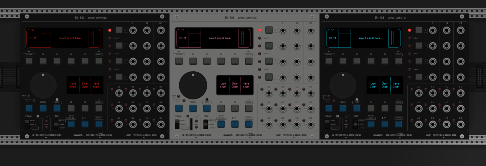

# ER-301 Sound Computer for VCV Rack



## Table of Contents

- [Introduction](#introduction)
- [Features](#features)
- [Building](#building)
- [User data](#user-data)
- [Repository layout](#repository-layout)
- [Licensing and attribution](#licensing-and-attribution)

## Introduction

ER-301 Sound Computer is a VCV Rack 2 port of the ER-301 emulator by **Brian Clarkson / Orthogonal Devices**, maintained by **Jeff Triggs / Festivamente**.

The port embeds the ER-301 application, display, unit library, package system, and audio engine directly inside VCV Rack.

- Original ER-301 repository: [https://github.com/odevices/er-301](https://github.com/odevices/er-301)
- VCV Rack port: [https://github.com/Festivamente/ER-301SoundComputer](https://github.com/Festivamente/ER-301SoundComputer)

This port is developed and distributed with permission from Orthogonal Devices.

## Features

The original ER-301 interface, package manager, unit library, and hardware-style workflow remain intact. In addition to the capabilities of the original hardware, the VCV Rack version adds:

- native file browsing
- desktop text entry
- multiple isolated ER-301 instances in a single Rack patch
- per-instance state save and restore in Rack patches and VCV module presets
- direct access to the virtual front card from the context menu or physical SD-card slot
- Silver and Black panel finishes
- selectable display colors
- native ER-301 operation at 48 kHz and 96 kHz, with host-rate conversion at other Rack sample rates
- direct VCV Rack CV output from the ER-301's four outputs
- processing headroom determined by the host computer rather than the original hardware CPU

## Building

A Rack 2 SDK is required.

If you do not already have one, download the appropriate Rack SDK from:

[https://vcvrack.com/manual/Building](https://vcvrack.com/manual/Building)

Unzip it beside this repository so that the directories look like:

```text
Rack-SDK/
VCVRackER-301/
```

If you already keep the Rack SDK somewhere else, set `RACK_DIR`:

```bash
export RACK_DIR="/path/to/Rack-SDK"
```

**Windows:** Install [MSYS2](https://www.msys2.org/) and run the build from the **MinGW 64-bit (`MINGW64`)** shell. Do not use the default MSYS or UCRT64 shell.


### Build

From the top directory:

```bash
make install
```

The first build prepares the required third-party dependencies. This can take a while on slower machines. Subsequent builds reuse them.

See [docs/BUILDING.md](docs/BUILDING.md) for additional build information.

## User data

ER-301 packages, samples, preferences, and instance data are stored in Rack's user data directory under:

```text
ER-301SoundComputer/
```

On macOS this is typically:

```text
~/Library/Application Support/Rack2/ER-301SoundComputer/
```

The VCV port ships `core-0.7.0-dev1.8.pkg` on the virtual front card and installs it through the normal ER-301 package manager on first setup. It remains an ordinary package: it can be uninstalled and manually reinstalled from `front/ER-301/packages/`.

## Repository layout

```text
VCVRackER-301/
├── src/
├── res/
├── er-301-native/
├── third-party/
├── Makefile
└── third-party.mk
```

`src/` and `res/` contain the VCV Rack integration.

`er-301-native/` contains the upstream-derived Orthogonal Devices source.

`third-party/` contains the dependencies required by the port.

## Licensing and attribution

The VCV Rack port is distributed under **GPL-3.0-or-later**.

The upstream-derived ER-301 source retains its **MIT License** and Brian Clarkson's copyright notice. Third-party components retain their respective licenses.

See:

- `LICENSE`
- `ATTRIBUTION.md`
- `THIRD_PARTY_NOTICES.md`
- `er-301-native/LICENSE.md`

Release version: **2.1.0**

VCV Rack port by **Jeff Triggs / Festivamente** — [https://festivamente.com](https://festivamente.com)
